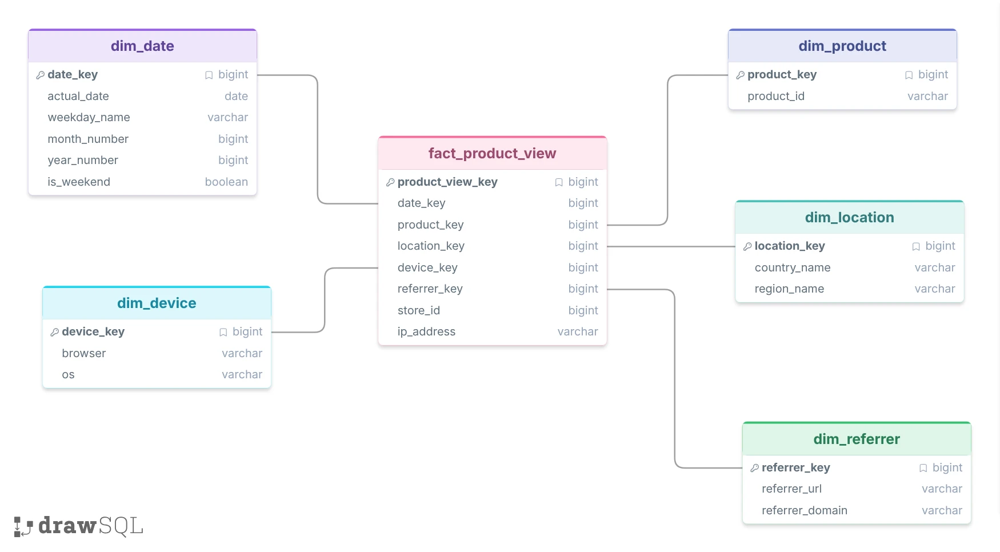

# Glamira: Kafka -> Spark -> Postgres

This project processes `product_view` events in real time:

```text
Kafka -> Spark Structured Streaming -> PostgreSQL -> Streamlit Dashboard
```

Spark reads events from Kafka, processes and enriches the data, then stores it in PostgreSQL using a star schema.

## Features

- Read `product_view` events from the Kafka topic `product_view_local`.
- Process data with Spark Structured Streaming.
- Enrich events with:
  - Country / Region from IP2Location.
  - Browser / OS from User-Agent.
  - Date, hour, weekday, month, year, and weekend information.
  - Domain and referrer information.
- Store data in PostgreSQL using:
  - `fact_product_view`
  - `dim_date`
  - `dim_product`
  - `dim_location`
  - `dim_device`
  - `dim_referrer`
- Prevent duplicate events when processing or replaying Kafka data.
- Provide 6 reports:
  1. Top 10 products viewed today.
  2. Top 10 countries by views today.
  3. Top 5 referrers by views today.
  4. Views by `store_id` and country.
  5. Hourly views for a selected `product_id`.
  6. Hourly views by Browser and OS.
- Provide a Streamlit dashboard for visualizing the reports.

## Project Structure

```text
glamira-spark-postgres/
├── main.py
├── report_dashboard.py
├── requirements.txt
├── environment.yml
├── .env
│
├── spark_job/
│   ├── config.py
│   ├── schema.py
│   ├── utils.py
│   ├── geoip.py
│   └── db.py
│
└── sql/
    └── schema.sql
```

## Data Model



## Requirements

The following services/tools should already be available:

- Docker
- Kafka
- PostgreSQL
- Python 3
- Spark Docker image: `unigap/spark:3.5`
- IP2Location BIN file: `IP-COUNTRY-REGION-CITY.BIN`

This project uses the Kafka setup from the `kafka-mongo` project and reads from:

```text
product_view_local
```

PostgreSQL should have a database named `glamira`.

Setup of Kafka, PostgreSQL, pgAdmin, Docker, and the IP2Location database is environment-dependent and is not covered here.

## Configuration

Create a `.env` file in the project directory.

Example:

```env
LOCAL_KAFKA_BOOTSTRAP_SERVERS=kafka-0:9092
LOCAL_KAFKA_SECURITY_PROTOCOL=SASL_PLAINTEXT
LOCAL_KAFKA_SASL_MECHANISM=PLAIN
LOCAL_KAFKA_USERNAME=kafka
LOCAL_KAFKA_PASSWORD=your_password

LOCAL_KAFKA_TOPIC=product_view_local
CONSUMER_GROUP_ID=product_view_spark_group
AUTO_OFFSET_RESET=latest

CHECKPOINT_DIR=/data/checkpoints/product_view
TRIGGER_INTERVAL=30 seconds

POSTGRES_HOST=localhost
POSTGRES_PORT=5432
POSTGRES_DB=glamira
POSTGRES_USER=postgres
POSTGRES_PASSWORD=postgres

IP2LOCATION_BIN_PATH=/data/geoip/IP-COUNTRY-REGION-CITY.BIN
IP2LOCATION_MODE=FILE_IO
```

Use a different `CONSUMER_GROUP_ID` from the `kafka-mongo` consumer so Spark can consume the same topic independently.

## Database

Run `sql/schema.sql` against the `glamira` database to create the required tables, views, and functions.

After the database schema is ready, Spark can start writing events to PostgreSQL.

## Run Spark

Run Spark:

```bash
docker container stop test-spark || true && docker container rm test-spark || true && docker run --rm -i --name test-spark   --network=streaming-network   --add-host=host.docker.internal:host-gateway   -v ~/Project/glamira-spark-postgres:/spark/glamira-spark-postgres   -v spark_lib:/home/spark/.ivy2   -v spark_data:/data   -e PYSPARK_DRIVER_PYTHON=python   -e PYSPARK_PYTHON=python   -e POSTGRES_HOST=host.docker.internal   unigap/spark:3.5 bash -c "
    cd /spark/glamira-spark-postgres &&
    zip -r /tmp/spark_job.zip spark_job/* &&
    conda env create --file environment.yml &&
    source ~/miniconda3/bin/activate &&
    conda activate pyspark_conda_env &&
    spark-submit \
      --packages org.apache.spark:spark-sql-kafka-0-10_2.12:3.5.1,org.postgresql:postgresql:42.7.3 \
      --master local[*] \
      --py-files /tmp/spark_job.zip \
      main.py
  " 2>&1 | grep -v "KafkaDataConsumer is not running in UninterruptibleThread"
```

Spark will continue running and process new events from Kafka.

If existing Kafka events need to be processed, change:

```env
AUTO_OFFSET_RESET=latest
```

to:

```env
AUTO_OFFSET_RESET=earliest
```

or produce new events after Spark starts.

## Run Dashboard

Create and activate a Python virtual environment:

```bash
cd ~/Project/glamira-spark-postgres

python3 -m venv .venv
source .venv/bin/activate

pip install -r requirements.txt
```

Start the dashboard:

```bash
streamlit run report_dashboard.py
```

The dashboard provides:

- Top 10 products.
- Top 10 countries.
- Top 5 referrers.
- Store views by country.
- Hourly views by product.
- Hourly views by Browser / OS.

The dashboard reads data directly from PostgreSQL and can be refreshed to display the latest results.

## Reports

The reports can also be queried directly from PostgreSQL:

```sql
SELECT * FROM glamira.rpt_top10_products_today;

SELECT * FROM glamira.rpt_top10_countries_today;

SELECT * FROM glamira.rpt_top5_referrers_today;

SELECT *
FROM glamira.get_store_views_by_country('Vietnam');

SELECT *
FROM glamira.get_hourly_views_by_product('96672', CURRENT_DATE);

SELECT *
FROM glamira.rpt_hourly_views_by_browser_os_today;
```

## Data Flow

```text
Kafka
  │
  │ product_view_local
  ▼
Spark Structured Streaming
  │
  ├── Parse event
  ├── IP2Location
  ├── Browser / OS
  ├── Date / Hour
  └── Referrer / Domain
  │
  ▼
PostgreSQL
  │
  ├── Dimension tables
  └── Fact table
  │
  ▼
SQL Reports
  │
  ▼
Streamlit Dashboard
```